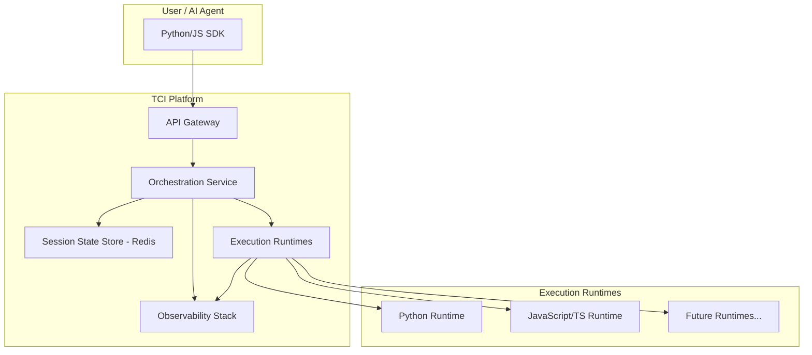

# Technical Blueprint: The Code Interpreter (TCI) System

**Version:** 1.0
**Date:** 2023-10-27
**Author:** Jules

## 1. Introduction

This document outlines the technical specification for the Code Interpreter (TCI), a secure, scalable, and language-agnostic platform for executing untrusted code. TCI is designed to be the foundational infrastructure for a new generation of AI applications, providing a safe and reliable way for AI agents and language models to perform complex tasks, learn from feedback, and interact with data.

The system's core value proposition is to unlock the full potential of AI by giving it a critical tool—the ability to write and execute code—within a robust, enterprise-grade security framework.

---

## 2. System Architecture

TCI is designed as a cloud-native, distributed system based on a microservices architecture. This ensures scalability, resilience, and maintainability.

### 2.1. High-Level Diagram



### 2.2. Component Descriptions

*   **SDK (Client-side):** Provides a simple, high-level interface for developers and AI agents to interact with the TCI platform. Initial support will be for Python and JavaScript/TypeScript.
*   **API Gateway:** The single entry point for all incoming traffic. It is responsible for request routing, authentication (API key validation), rate limiting, and SSL termination.
*   **Orchestration Service:** The core of TCI. It manages the entire lifecycle of a code execution session, including:
    *   Creating and provisioning new sandboxed environments.
    *   Dispatching code execution requests to the appropriate runtime.
    *   Managing session state (persisting files, variables, etc.).
    *   Terminating and cleaning up environments after a session ends.
*   **Session State Store:** A fast, persistent key-value store (e.g., Redis) that holds session-specific data, such as files created during execution, environment variables, and cached dependencies. This allows for stateful, multi-turn interactions.
*   **Execution Runtimes:** The isolated environments where the code is actually executed. Each runtime is a sandboxed, language-specific environment. See the Security Model for details on the sandboxing strategy.
*   **Observability Stack:** A suite of tools (e.g., Prometheus, Grafana, Loki) for real-time monitoring of system health, performance metrics, and centralized logging. This is crucial for reliability and security auditing.

---

## 3. API Design & SDK Specifications

The primary way to interact with TCI is through its SDKs. The API is designed to be intuitive and session-based.

### 3.1. Core Concepts

*   **Session:** A stateful, isolated environment that persists across multiple `execute` calls. It has its own ephemeral filesystem and state. Sessions are identified by a unique `session_id`.
*   **Execution:** A single, atomic request to run a block of code within a session.

### 3.2. Python SDK Example

```python
from tci import TCIClient, File

# 1. Initialize the client
tci = TCIClient(api_key="your_api_key")

# 2. Create a new session
session = tci.sessions.create(language="python")

try:
    # 3. Upload a file to the session's filesystem
    tci.files.upload(
        session_id=session.id,
        remote_path="data.csv",
        content=b"col1,col2\n1,2\n3,4"
    )

    # 4. Execute code that uses the file
    code = """
import pandas as pd
df = pd.read_csv('data.csv')
result = df['col1'].sum()
print(f"The sum is {result}")
"""
    execution = tci.executions.run(
        session_id=session.id,
        code=code,
        # Define tests for RL-style reward calculation
        tests=[{
            "name": "Check sum",
            "condition": "result == 4",
            "reward": 1.0
        }]
    )

    # 5. Process the results
    print(execution.stdout) # Output: "The sum is 4"
    print(execution.result)  # The last evaluated expression: 4
    print(execution.tests[0].passed) # True
    print(execution.tests[0].reward) # 1.0

finally:
    # 6. Clean up the session
    tci.sessions.close(session_id=session.id)

```

### 3.3. TypeScript/JavaScript SDK Example

```typescript
import { TCIClient, File } from '@tci/sdk';

// 1. Initialize the client
const tci = new TCIClient({ apiKey: 'your_api_key' });

async function main() {
    // 2. Create a new session
    const session = await tci.sessions.create({ language: 'javascript' });

    try {
        // 3. Execute code
        const code = `
            const fs = require('fs');
            fs.writeFileSync('output.txt', 'Hello from TCI!');
            const result = 10 * 2;
            result; // The last expression is returned
        `;

        const execution = await tci.executions.run({
            sessionId: session.id,
            code: code,
        });

        // 4. Process results and download generated files
        console.log(execution.result); // Output: 20
        const outputFile = await tci.files.download(session.id, 'output.txt');
        console.log(outputFile.toString()); // "Hello from TCI!"

    } finally {
        // 5. Clean up
        await tci.sessions.close(session.id);
    }
}

main();
```

---

## 4. Security Model

Security is the most critical aspect of the TCI platform. We employ a multi-layered, defense-in-depth strategy to ensure that untrusted code can never compromise the host system or other tenants.

*   **Layer 1: Process & Filesystem Isolation:** Each session runs in a separate, minimal Docker container with a read-only root filesystem. An ephemeral, in-memory filesystem (`tmpfs`) is provided for runtime file I/O.
*   **Layer 2: Kernel-Level Hardening:** We use **gVisor** to intercept and sandbox system calls made by the running code. This provides a strong second layer of isolation, acting as a user-space kernel and dramatically reducing the attack surface of the host kernel.
*   **Layer 3: Strict Resource Management:** Each container is subject to strict resource limits (cgroups) on CPU, memory, and execution time. This prevents denial-of-service attacks and noisy neighbor problems.
*   **Layer 4: Network Egress Control:** Network access is disabled by default. If required, it can be enabled on a per-session basis through a proxy that enforces strict allowlists on domains and ports, preventing SSRF attacks and unauthorized data exfiltration.
*   **Layer 5: Static Analysis:** Before execution, code is scanned for obvious malicious patterns (e.g., attempting to import known sensitive libraries, obfuscated code), providing a first-pass filter.

---

## 5. Use Cases

### 5.1. Interactive RL Environment for AI Training

An AI model can be trained to write code by using TCI as its environment.

*   **Goal:** Train an agent to write a correct Python function to calculate Fibonacci numbers.
*   **Workflow:**
    1.  The training loop provides the agent with a function signature (e.g., `def fib(n):`).
    2.  The agent generates the function body.
    3.  The complete code is sent to a TCI session.
    4.  TCI executes the code against a set of hidden unit tests (e.g., `assert fib(5) == 5`, `assert fib(10) == 55`).
    5.  TCI returns the results, including which tests passed and a `reward` score (e.g., 0.75 for 3/4 tests passed).
    6.  The agent uses this reward signal to update its policy via reinforcement learning.

### 5.2. Agentic Workflows for Data Analysis

An AI assistant powered by an LLM can perform complex data analysis for a user.

*   **Goal:** A user uploads a CSV and asks, "What is the correlation between column A and column B?"
*   **Workflow:**
    1.  The AI assistant creates a TCI session and uploads the user's CSV.
    2.  The LLM generates Python code using the `pandas` library to read the CSV and calculate the correlation.
    3.  The code is executed in TCI. The result (a correlation matrix or a single float) is returned.
    4.  The LLM interprets the numerical result and provides a natural language answer to the user.
    5.  As a follow-up, the user asks for a visualization. The LLM generates code using `matplotlib` to create a scatter plot, saving it as `plot.png` in the TCI session.
    6.  The assistant uses the TCI SDK to download `plot.png` and displays it to the user.

---

## 6. Integration Examples

### 6.1. LangChain

TCI can be seamlessly integrated as a `Tool` for a LangChain agent.

```python
from langchain.agents import Tool
from tci import TCIClient

tci_client = TCIClient(api_key="...")
session = tci_client.sessions.create(language="python")

class TCIExecutionTool(BaseTool):
    name = "code_interpreter"
    description = "Executes Python code in a secure, stateful environment."

    def _run(self, code: str):
        try:
            result = tci_client.executions.run(session_id=session.id, code=code)
            return {"stdout": result.stdout, "result": result.result}
        except Exception as e:
            return f"Error executing code: {e}"

# This tool can now be added to any LangChain agent.
```

### 6.2. OpenAI Function Calling

Define a function schema that allows an OpenAI model to request code execution.

```json
{
  "name": "execute_python_code",
  "description": "Executes Python code in a secure sandbox.",
  "parameters": {
    "type": "object",
    "properties": {
      "code": {
        "type": "string",
        "description": "The Python code to execute."
      }
    },
    "required": ["code"]
  }
}
```
When the model outputs a function call with this schema, your application backend would simply forward the `code` parameter to the TCI SDK.

---

## 7. Development Roadmap

The development and rollout will be phased to prioritize security and stability.

*   **Q4 2024 - MVP Launch:**
    *   Core platform services (Orchestrator, API Gateway).
    *   Secure Python execution runtime with all security layers implemented.
    *   Initial Python SDK.
    *   Onboarding for a limited set of alpha partners.

*   **Q1 2025 - Public Beta:**
    *   Addition of JavaScript/TypeScript runtime.
    *   Implementation of the interactive RL reward system.
    *   Stateful sessions with file upload/download capabilities.
    *   Publicly available JS/TS SDK.

*   **Q2 2025 - General Availability (GA):**
    *   Full enterprise-grade features: SSO/SAML, Role-Based Access Control (RBAC), and detailed audit logs.
    *   Advanced monitoring and alerting dashboard for customers.
    *   Service Level Agreements (SLAs) for uptime and performance.

*   **H2 2025 & Beyond - Expansion:**
    *   Support for additional languages (e.g., Go, Rust, R).
    *   More complex, pre-built environments for specific domains (e.g., a "Data Science" environment with popular libraries pre-installed).
    *   VPC peering and private deployment options for enterprise customers.
